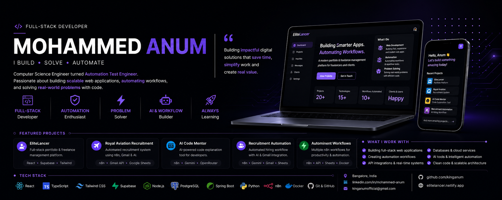

  

<h1 align="center">Hi 👋 I'm Mohammed Anum</h1>

<h3 align="center">
Automation Engineer • Full-Stack Developer • AI Workflow Builder
</h3>

---

# 🚀 About Me

💼 Automation Engineer (Client: Apple)

🤖 Passionate about AI Automation, Workflow Engineering & Full-Stack Development.

⚡ I enjoy building products that eliminate repetitive work through automation and modern software engineering.

### Current Focus

- 🤖 AI Workflow Automation
- 🌐 Full-Stack Web Development
- ⚙️ Test Automation

---

# 🛠 Tech Stack

## Languages

## Frontend

## Backend

## Database

## Automation

---

# 🤖 AI & Automation Projects

## ✈️ Royal Aviation Recruitment System

> AI-powered recruitment workflow

### Features

- Resume Parsing
- Gmail Automation
- AI Candidate Analysis
- Duplicate Detection
- Experience Calculation
- Google Sheets Integration
- Candidate Classification
- End-to-End Workflow using n8n

---

## ⚡ Locale Allocation Automation

Automated a repetitive manual process reducing approximately **1 hour** of manual work using:

- n8n
- Google Sheets
- APIs
- Docker

---

## 💻 AI Code Mentor

AI-powered developer assistant capable of:

- Code Explanation
- Bug Detection
- Code Review
- Optimization Suggestions
- Multiple LLM Support

---

# 💼 Featured Projects

| Project | Description |
|----------|-------------|
| ✈️ Royal Aviation Recruitment | AI Recruitment Platform |
| 💼 EliteLancer | Portfolio & Freelance Management |
| 📺 WatchTracker | Movie / Anime Tracking Platform |
| 🤖 AI Code Mentor | AI Code Assistant |
| ⚡ Automation Workflows | Productivity Automation |

---

# 📊 GitHub Analytics

---

# 🏆 GitHub Trophies

---

# 📈 Contribution Graph

---

# 🌐 Connect With Me

---

# 💡 Quote

> **"Automate repetitive work, build impactful solutions, and never stop learning."**

---

⭐ Thanks for visiting my profile!

